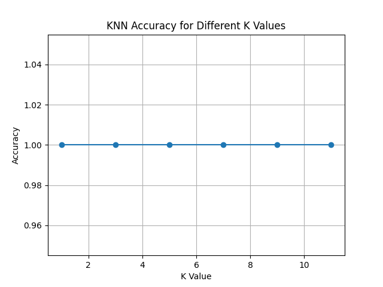
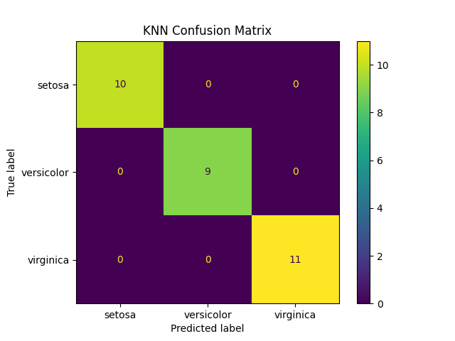
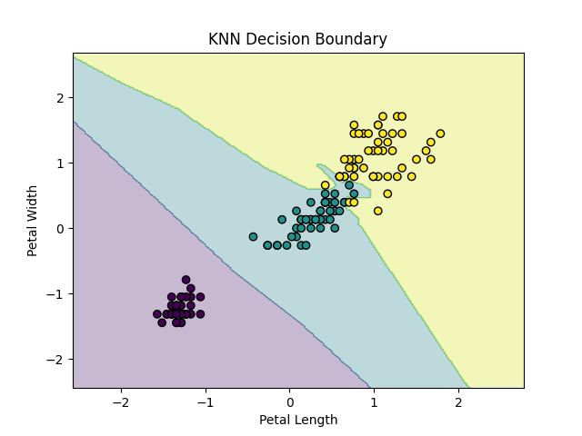

# KNN Classification using Iris Dataset

## 📌 Project Overview

This project implements the **K-Nearest Neighbors (KNN)** algorithm for classification using the **Iris dataset**.

The project includes feature normalization, experimentation with different K values, accuracy evaluation, confusion matrix, and decision boundary visualization.

---

## 🎯 Objective

To understand and implement the **K-Nearest Neighbors (KNN)** classification algorithm and evaluate its performance using different values of K.

---

## 📊 Dataset

The **Iris dataset** is used for this project.

It contains:

- **150 samples**
- **4 numerical features**
- **3 classes**

### Features

- Sepal Length
- Sepal Width
- Petal Length
- Petal Width

### Target Classes

- Setosa
- Versicolor
- Virginica

---

## 🛠️ Technologies Used

- **Python**
- **NumPy**
- **Pandas**
- **Scikit-learn**
- **Matplotlib**

---

## 🔄 Methodology

The following steps were performed:

1. Loaded the Iris dataset.
2. Split the dataset into training and testing sets.
3. Normalized the features using `StandardScaler`.
4. Applied the K-Nearest Neighbors classification algorithm.
5. Tested different values of K.
6. Compared the accuracy for each K value.
7. Selected the best-performing K value.
8. Evaluated the model using a confusion matrix.
9. Visualized the decision boundary using two features.

---

## 🔢 K Values Tested

The following K values were tested:

K = 1, 3, 5, 7, 9, 11

📈 Results

The model performance was evaluated using:

Accuracy
Confusion Matrix
K vs Accuracy graph
Decision Boundary
1. K vs Accuracy

2. Confusion Matrix

3. Decision Boundary

👩‍💻 Author

Hafsa Mohammed Afzal
